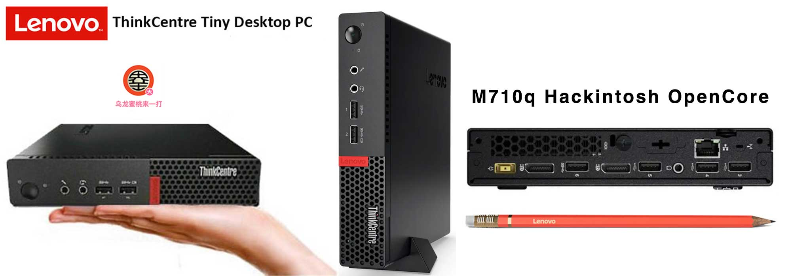
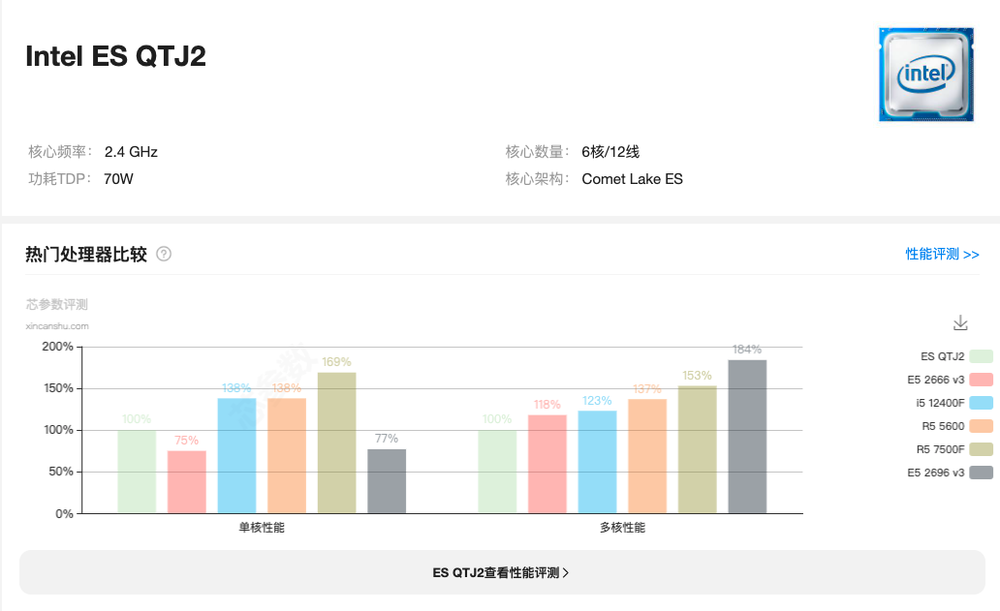

## ThinkCentre-M710q Hackintosh OpenCore EFI



### [简体中文](README.zh_CN.md)


### OpenCore

[OpenCore 0.9.7](https://github.com/acidanthera/OpenCorePkg)


### macOS

- Ventura
- Monterey
- Big Sur
- Catalina (`config.catalina.plist`)

Intel WLAN Notice: 
 - You need to repalce `AirportItlwm.kext` to your macOS version.
 - The default `AirportItlwm.kext` works on Ventura only. 


### Spec

- Chipset: Intel B250
- CPU: QTJ2
- Memo: Juhor 32GB(2x16GB) DDR4 2666 Mhz
- iGPU: Intel UHD Graphic 630
- HDA: Realtek ALC233
- SSD: MIRAGE HV2283 512G
- LAN: Intel
- WLAN: Intel AX210

### CPU/BIOS
- intel QTJ2（ i7-10750H ES ） with 6 cores and 12 threads.
- Basic frequency 2.4 GHz, acceleration frequency up to 4.3 GHz.
- With the 14nm process and the new generation Comet Lake ES architecture, it achieves a performance score of up to 1436 with only 70W power consumption。
- The processor also integrates an Intel UHD Graphics 630 graphics card.
- Magic modifying BIOS carries certain risks, please pay attention to the usage method to avoid unnecessary losses.
- Magic modified BIOS provided by[The Flash](hhttps://space.bilibili.com/424053631)。

<font color=orange>The native BIOS of the M710q does not support 8th and 9th generation CPUs, but by flashing a modified BIOS, it can support 8th and 9th generation CPUs as well as modified CPUs.<font>

### BIOS

```
Devices
  |-- ATA Drive Setup
    |-- Configure STAT as: ACHI
  |-- Video Setup
    |-- Select Active Video: IGD
    |-- Pre-Allocated Memory Size: 64MB
    |-- Total Graphics Memory: Maximum

Advanced
  |-- CPU Setup
    |-- Intel(R) Hyper-Threading Technology: Enabled
    |-- Core Multi-Processing: Enabled
    |-- Intel(R) Virtualization Technology: Enabled

Power
  |-- Automatic Power On
    |-- Wake on LAN: Disabled
    
Security
  |-- Secure Boot
    |-- Secure Boot: Disabled

Startup
  |-- Fast Boot: Disabled
```

### Notes
 - Use [OCAuxiliaryTools](https://github.com/ic005k/OCAuxiliaryTools) build your SMBIOS
 - U Must Use CFGLock.efi Tool Unlock CFG LOCK first


### Know Issue
 - Magic modified BIOS unable to sleep in hackintosh

### Screenshot


### QTJ2



### Kexts

- [Lilu.kext 1.6.7](https://github.com/acidanthera/Lilu)
- [SMCProcessor.kext 1.3.2](https://github.com/acidanthera/VirtualSMC)
- [SMCSuperIO.kext 1.3.2](https://github.com/acidanthera/VirtualSMC)
- [VirtualSMC.kext 1.3.2](https://github.com/acidanthera/VirtualSMC)
- [WhateverGreen.kext 1.6.6](https://github.com/acidanthera/WhateverGreen)
- [AppleALC.kext 1.8.8](https://github.com/acidanthera/AppleALC)
- [IntelMausi.kext 1.0.7](https://github.com/acidanthera/IntelMausi)


### Tools

- [Hackintool](https://github.com/headkaze/Hackintool) 
- [OCAuxiliaryTools](https://github.com/ic005k/OCAuxiliaryTools) AKA `OCAT`.
- [OpenCore Configurator](https://mackie100projects.altervista.org/opencore-configurator/) AKA `OCC`.
- [GenSMBIOS](https://github.com/corpnewt/GenSMBIOS) Generate SMBIOS.
- [MountEFI](https://github.com/corpnewt/MountEFI) Mount EFI partition.
- [EFI Agent](https://github.com/headkaze/EFI-Agent) Better EFI partition mount App.
- [gibMacOS](https://github.com/corpnewt/gibMacOS) Build your own MacOS image.
- [ProperTree](https://github.com/corpnewt/ProperTree) Plist editor.


### Contact Us

QQ Group: 23304408


