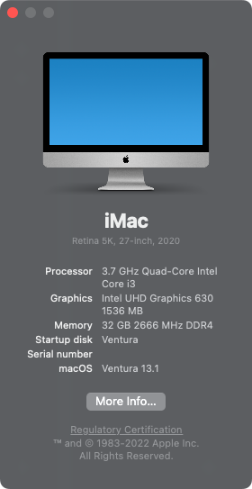
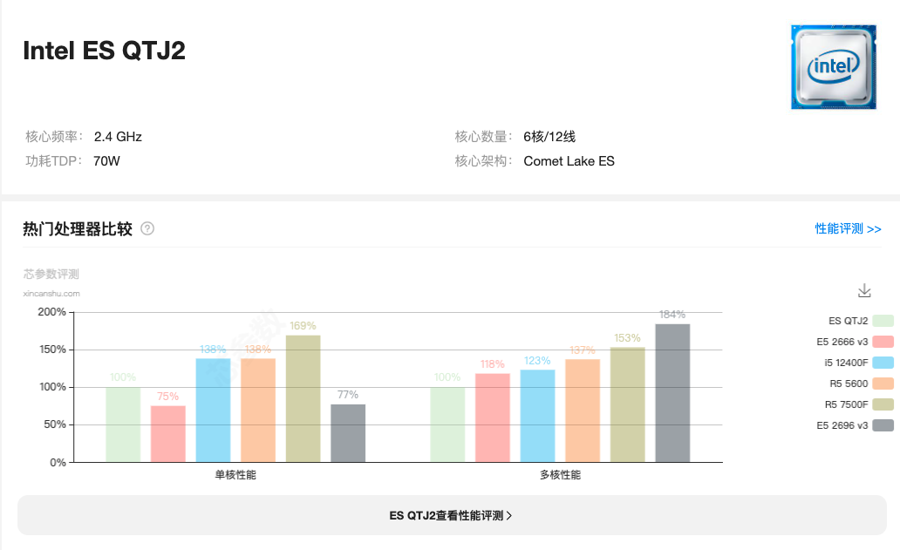

## ThinkCentre-M710q 黑苹果 OpenCore EFI


### [English](https://github.com/hackintosh-efi/ThinkCentre-M930q)


### OpenCore

[OpenCore 0.9.7](https://github.com/acidanthera/OpenCorePkg)


### macOS

- Ventura
- Monterey
- Big Sur
- Catalina (`config.catalina.plist`)

Intel 网卡注意: 
 - 替换 `AirportItlwm.kext` 为相应的 macOS 版本 
 - 默认 `AirportItlwm.kext` 仅支持 Ventura 系统


### 机器配置

- 主板: Intel B250
- 处理器: Intel i3-10105
- 内存: 玖合 32GB(2x16GB) DDR4 2666 Mhz
- 显卡: 英特尔® 超核芯显卡 630
- 声卡: Realtek ALC233
- 硬盘: 幻隐 HV2283 512G
- 网卡: Intel
- 无线: Intel AX210

### CPU/BIOS
- intel ES QTJ2是一款6核心12线程。
- 基础频率2.4 GHz加速频率高达4.3 GHz处理器。
- 凭借着14 nm工艺及新一代Comet Lake ES架构仅70W功耗就实现了高达1436性能跑分。
- 处理器还集成了Intel UHD Graphics 630显卡。
- 魔改BIOS具有一定风险，请注意使用方法，避免不要的损失。
- 魔改BIOS由[闪电](hhttps://space.bilibili.com/424053631)提供。

<font color=orange>m710q原生BIOS不支持8-9代cpu，通过刷魔改BIOS可以支持8-9代cpu以及魔改u<font>


### BIOS设置

```
设备
  |-- ATA设备菜单
    |-- 配置SATA为: ACHI
  |-- 显示菜单
    |-- 选择有效显示: IGD
    |-- 预指派内存大小: 64MB
    |-- 全部显示内存: 最大

高级菜单
  |-- CPU菜单
    |-- Intel(R) HT技术: 打开
    |-- 多核心处理功能: 打开
    |-- Intel(R) Virtualization技术: 打开

电源
   |-- 自动开机
    |-- Wake on LAN: 关闭

安全菜单
  |-- 安全启动
    |-- 安全启动: 关闭

启动菜单
  |-- 极速启动: 关闭
```

### 注意事项
 - 使用 [OCAuxiliaryTools](https://github.com/ic005k/OCAuxiliaryTools) 生成 SMBIOS
 - 安装前务必使用CFGLock.efi工具解锁 CFG LOCK


### 已知问题

 - 使用魔改BIOS后，黑苹果无法正常睡眠


### 系统截图




### QTJ2



### 驱动

- [Lilu.kext 1.6.7](https://github.com/acidanthera/Lilu)
- [SMCProcessor.kext 1.3.2](https://github.com/acidanthera/VirtualSMC)
- [SMCSuperIO.kext 1.3.2](https://github.com/acidanthera/VirtualSMC)
- [VirtualSMC.kext 1.3.2](https://github.com/acidanthera/VirtualSMC)
- [WhateverGreen.kext 1.6.6](https://github.com/acidanthera/WhateverGreen)
- [AppleALC.kext 1.8.8](https://github.com/acidanthera/AppleALC)
- [IntelMausi.kext 1.0.7](https://github.com/acidanthera/IntelMausi)


### 工具

- [Hackintool](https://github.com/headkaze/Hackintool) 
- [OCAuxiliaryTools](https://github.com/ic005k/OCAuxiliaryTools) 即 `OCAT`.
- [OpenCore Configurator](https://mackie100projects.altervista.org/opencore-configurator/) 即 `OCC`。
- [GenSMBIOS](https://github.com/corpnewt/GenSMBIOS) 三码生成工具。
- [MountEFI](https://github.com/corpnewt/MountEFI) EFI 分区挂载工具。
- [EFI Agent](https://github.com/headkaze/EFI-Agent) 更方便的EFI分区挂载工具。
- [gibMacOS](https://github.com/corpnewt/gibMacOS) macOS 官方镜像下载工具。
- [ProperTree](https://github.com/corpnewt/ProperTree) Plist 编辑器。


### 联系我们

QQ群: 23304408


